# CluckQuest Chicken 🐔

Аркадно-стратегическая игра для iOS, где игроки исследуют ферму в пастельных тонах в роли любопытной курицы, играют в мини-игры и решают головоломки для разблокировки новых областей и сокровищ.

## 🎮 Обзор игры

**CluckQuest Chicken** — это очаровательная игра-исследование фермы, созданная с использованием UIKit и SpriteKit. Игроки берут на себя роль любопытной курицы, исследующей различные области фермы, выполняющей квесты, играющей в мини-игры и строящей свою куриную империю.

### Основные возможности

- **Исследование фермы** 🌾🥕 - Нажимайте на тропинки, чтобы открыть скрытые сараи и курятники
- **Мини-игры** 🐛🎯 - Сцены SpriteKit для ловли мучных червей, клевания целей
- **Головоломки** 🧩🔍 - Игра памяти, скользящие пазлы с фермерскими эмодзи
- **Система квестов** 📋 - Выполняйте "Пернатые квесты" для получения наград
- **Система достижений** 🏅 - Разблокируйте значки и получайте шутки CoopBot
- **Фермопедия** 📚 - Узнавайте о курах, вредителях, инструментах и растениях
- **Система прогрессии** ⬆️ - Зарабатывайте CluckCoins и опыт для улучшения курятника

## 📱 Основные экраны

### 1. Меню 🏡
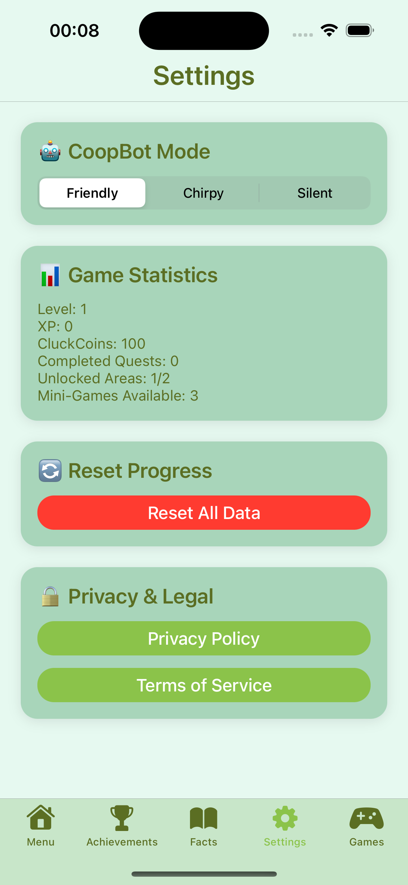
- Панель управления фермой со статистикой (Уровень, Опыт, CluckCoins)
- Быстрый доступ к карте, квестам, сараю инструментов и рынку
- Индикаторы прогресса в реальном времени

### 2. Достижения 🏅
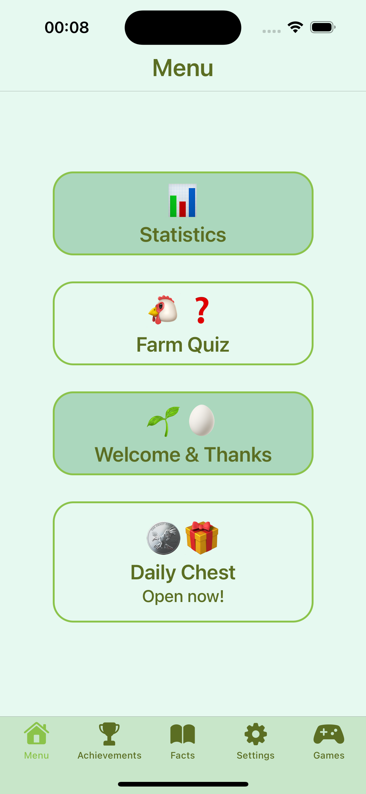
- Коллекция значков с эмодзи и названиями
- Шутки CoopBot при разблокировке
- Отслеживание прогресса для различных достижений

### 3. Факты 📚
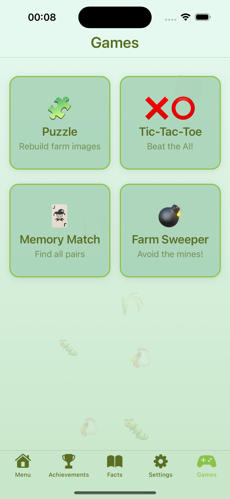
- Фермопедия с категоризированными знаниями о ферме
- Сортировка и фильтрация по категориям (Куры, Вредители, Инструменты, Растения)
- Интерактивные карточки фактов с подробными описаниями

### 4. Настройки ⚙️
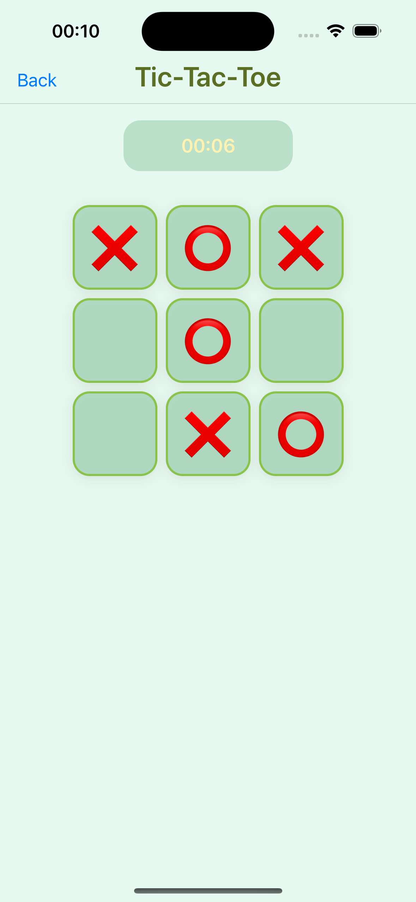
- Выбор режима CoopBot (Дружелюбный/Веселый/Тихий)
- Отображение игровой статистики
- Функция сброса прогресса
- Ссылки на политику конфиденциальности и условия использования

### 5. Игры 🎮

- Центр мини-игр с выбором сложности
- Отслеживание лучших результатов
- Реализации игр на SpriteKit и UIKit

## 🎯 Мини-игры

### Крестики-нолики 🎯
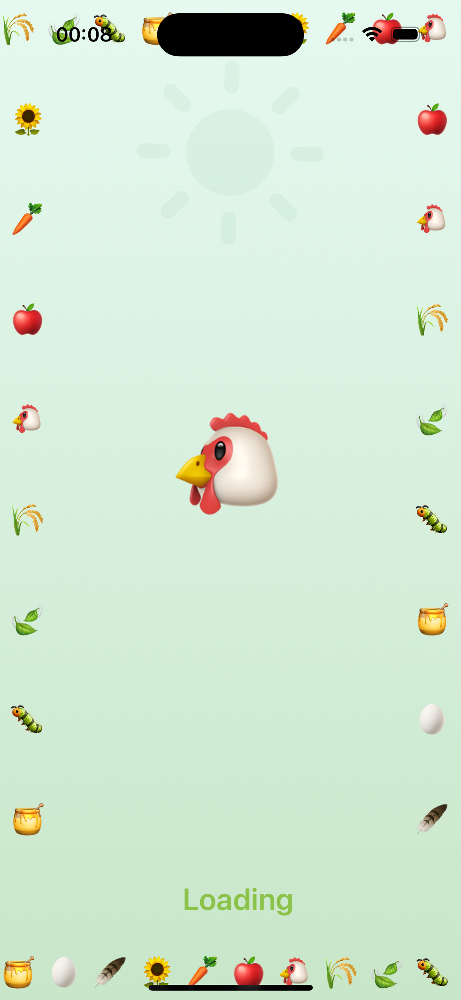
- Классическая игра против ИИ
- Множественные уровни сложности
- Отслеживание побед и поражений

### Фермерский сапер 💣
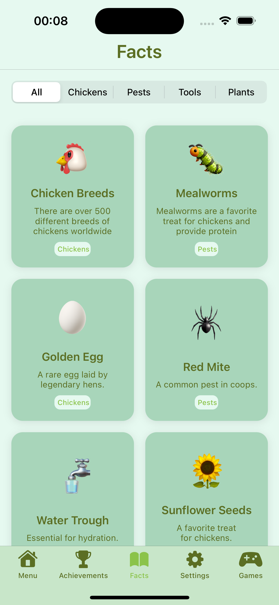
- Избегайте мин на фермерском поле
- Различные размеры поля
- Отслеживание времени и количества мин

### Игра памяти 🧩
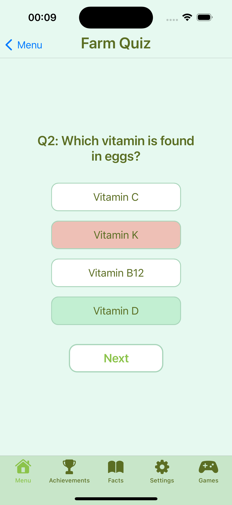
- Сопоставление карточек с фермерскими эмодзи
- Множественные уровни сложности (4/8/12 пар)
- Отслеживание времени и количества переворотов

### Сборка пазла 🧩
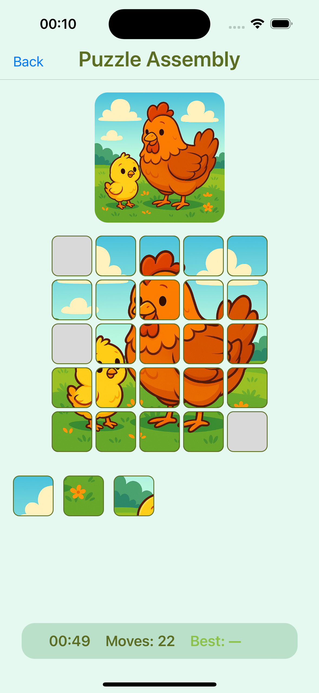
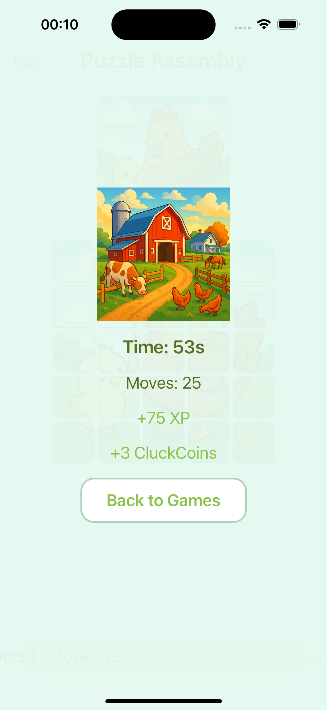
- Восстановление изображений фермы
- Различные размеры пазлов
- Отслеживание времени и количества ходов

### Фермерская викторина ❓
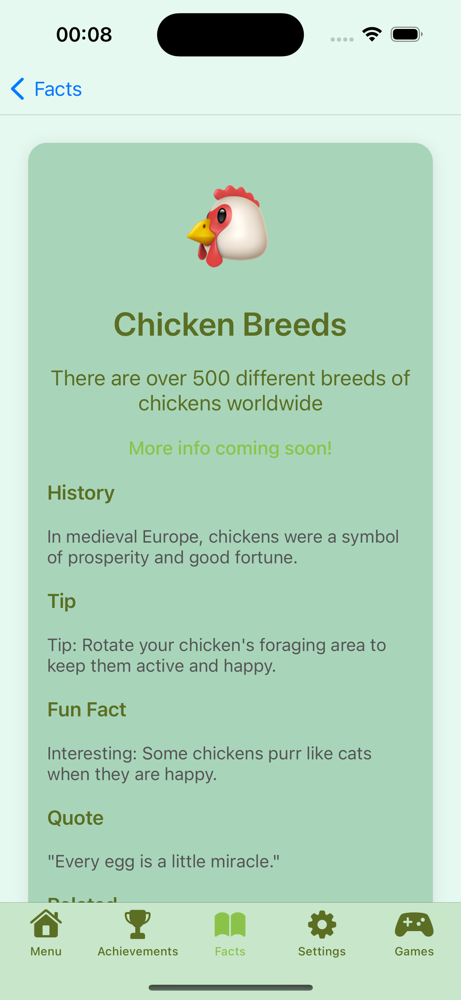
- Вопросы о фермерстве и животных
- Множественный выбор ответов
- Обучение через игру

### Ежедневный сундук 🎁
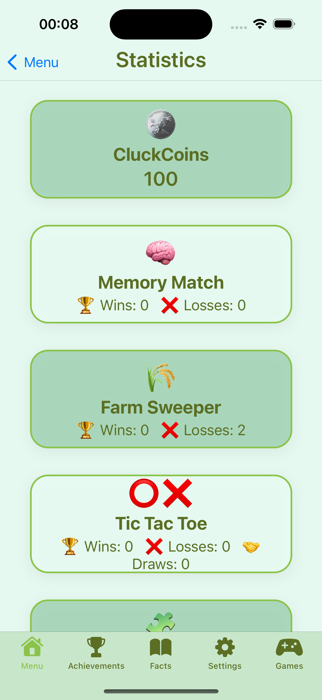
- Ежедневные награды
- Очки опыта и монеты
- Система мотивации

### Экран загрузки ⏳
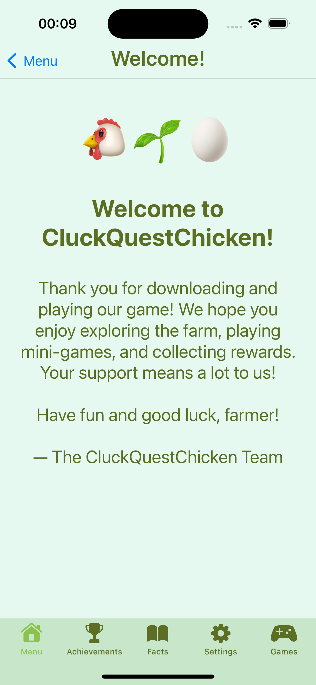
- Красивый экран загрузки
- Фермерская тематика
- Плавные переходы

### Приветственный экран 👋
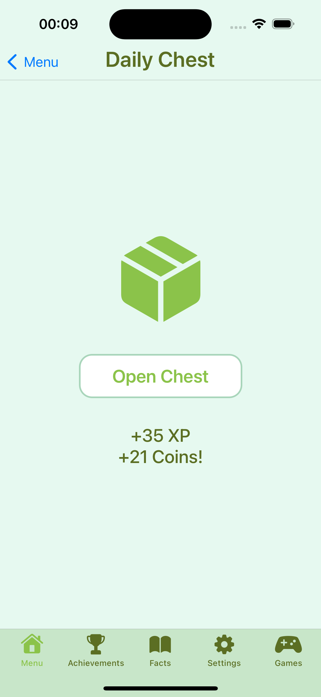
- Добро пожаловать в игру
- Информация о команде разработчиков
- Благодарность игрокам

### Детальная информация о фактах 📖
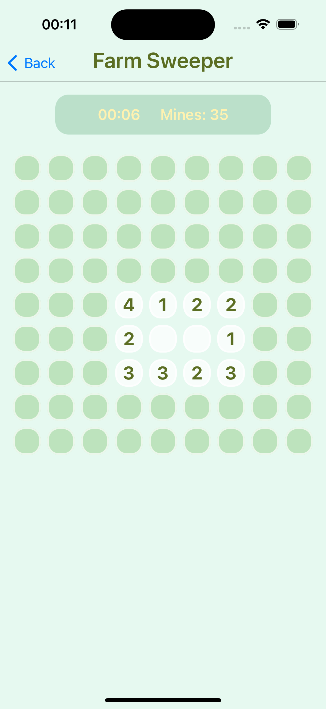
- Подробная информация о породах кур
- Исторические факты
- Советы и интересные факты

## 🛠 Технические характеристики

- **Язык**: Swift
- **UI Framework**: UIKit (с SpriteKit для мини-игр)
- **Архитектура**: MVVM
- **Хранилище**: UserDefaults
- **Целевая платформа**: iPhone SE (2022) и выше
- **Графика**: Только эмодзи и SF Symbols
- **Сеть**: 100% офлайн
- **Конфиденциальность**: Не требует входа, полностью локальное хранение данных

## 🎨 Визуальный дизайн

### Цветовая палитра
- **Мятное пастбище**: #E6F9F0
- **Шалфейный луг**: #C8E6C9
- **Фисташковая роща**: #A8D5BA
- **Мох акцент**: #8BC34A
- **Текст сарая**: #5B6E23

### Элементы дизайна
- Мягкие пастельные градиенты
- Скругленные карточки с радиусом углов 16pt
- Деревянные панели с фисташковым оттенком
- Мягкие тени (прозрачность 0.1, радиус 6)
- Типографика SF Pro Rounded

## 🏗 Структура проекта

```
CluckQuestChicken/
├── AppDelegate.swift                    # Точка входа приложения
├── CluckQuestChickenDesignSystem.swift  # Система дизайна и стили
├── CluckQuestChickenModels.swift        # Модели данных
├── CluckQuestChickenDataManager.swift   # Хранилище UserDefaults
├── CluckQuestChickenMainTabBarController.swift # Основная навигация
├── CluckQuestChickenMenuViewController.swift   # Панель управления фермой
├── CluckQuestChickenAchievementsViewController.swift # Значки
├── CluckQuestChickenFactsViewController.swift  # Фермопедия
├── CluckQuestChickenSettingsViewController.swift # Настройки
├── CluckQuestChickenGamesViewController.swift  # Центр мини-игр
├── CluckQuestChickenBugHuntViewController.swift # Игра на SpriteKit
├── CluckQuestChickenPlaceholderViewControllers.swift # Заглушки
└── Info.plist                          # Конфигурация приложения
```

## 🚀 Начало работы

1. Откройте `CluckQuestChicken.xcodeproj` в Xcode
2. Выберите целевое устройство (iPhone SE 2022 или новее)
3. Соберите и запустите проект
4. Начните исследовать ферму!

## 🎮 Игровой цикл

1. **Исследуйте** - Нажимайте на области карты для открытия новых зон
2. **Играйте** - Участвуйте в мини-играх и головоломках
3. **Зарабатывайте** - Собирайте CluckCoins и опыт
4. **Улучшайте** - Улучшайте инструменты и разблокируйте новые области
5. **Завершайте** - Выполняйте квесты и получайте достижения

## 🔧 Примечания разработки

- Все классы, структуры, функции и переменные имеют префикс `CluckQuestChicken`
- В проекте не используются комментарии к коду
- UserDefaults обрабатывает все сохранение данных
- SpriteKit используется для интерактивных мини-игр
- UIKit обрабатывает все компоненты UI и навигацию

## 🎯 Будущие улучшения

- Полная реализация игр "Ловля зерна" и "Игра памяти"
- Исследование карты фермы с интерактивными областями
- Система квестов с разветвленными сюжетными линиями
- Система управления инвентарем
- Рыночная лавка с покупаемыми предметами
- Сезонные события и специальные испытания

## 📄 Лицензия

Этот проект создан в образовательных и развлекательных целях.

---

**Превратите свой скромный курятник в легендарную куриную империю веселья и перьев!** 🐔✨ 